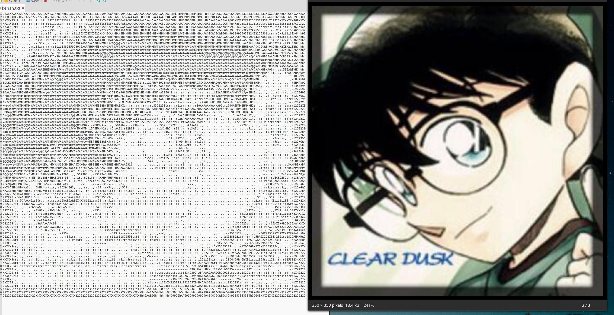
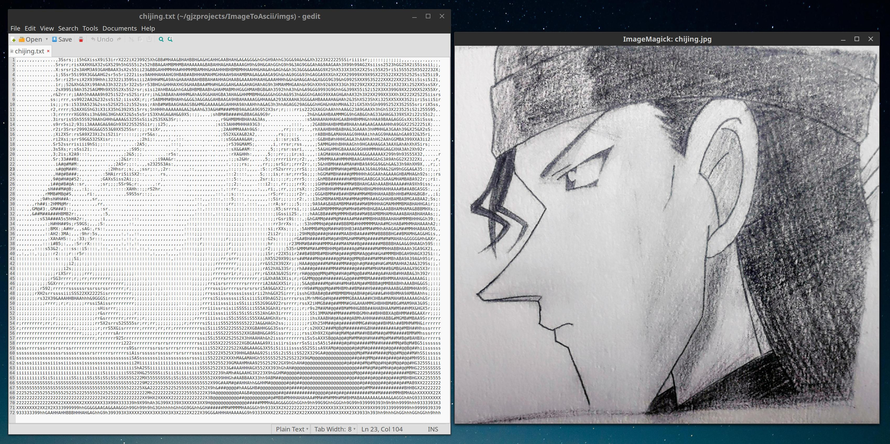
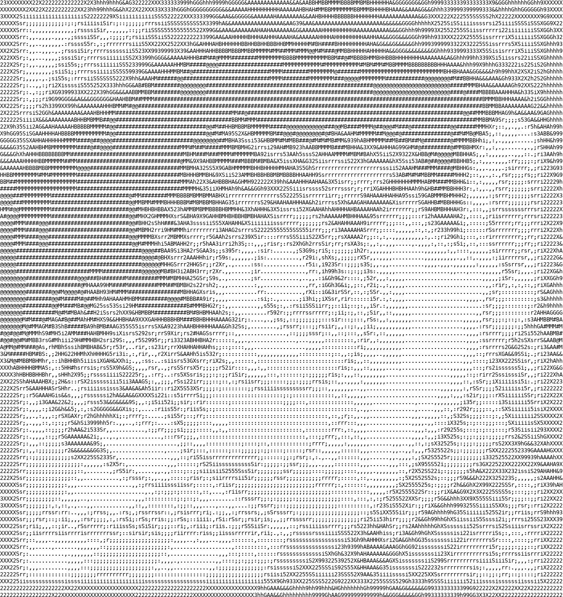
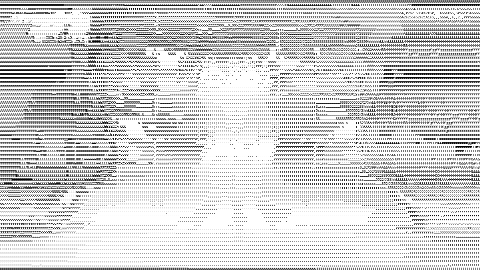

## Intro
This is a simple, light and optimized **image-to-ascii** and **ascii-to-image** converter. It now supports image and video.

## 1. Image to Ascii
This conversion is implemented by mapping the intensity of pixel to characters with different shape.
### Command option
`-f | --file` is input image path.

`-s | --scale` controls the output size.

`-a | --aspect` controls the aspect of height and width.

`-w | --write-file` is the output ascii txt path.

### Usage
```
# lazy style: the default output is ${img_file}.txt
python img_to_ascii.py -f imgs/erke.jpg

# adjust sampling step, the output is larger if it is samller
python img_to_ascii.py -f imgs/erke.jpg -s 2

# complete style
python img_to_ascii.py -f imgs/erke.jpg -s "auto" -w out.txt
```

### Samples
<p align="center">
    
</p>

<p align="center">
    
</p>

### Notes
You can adjust the font size of text editor for better view.

## 2. Ascii to Image
It calls the text drawing API of `PIL` to implement the rendering of ascii text to image.
```
python ascii_to_img.py -f imgs/kenan.txt -w imgs/kenan_ascii.jpg
```

<p align="center">
    
</p>

## 3. Video conversion
```
python ascii_art.py -f videos/kenan.mp4 -s 1 -e 360 -w res/kenan.gif -p 10 --step=10 --scale=0.25 --sampling-step=6
```

More videos to see [BaiduYun](https://pan.baidu.com/s/1gYcRH_Tx9aiy73N4rqzxvw).

<p align="center">
    
</p>
